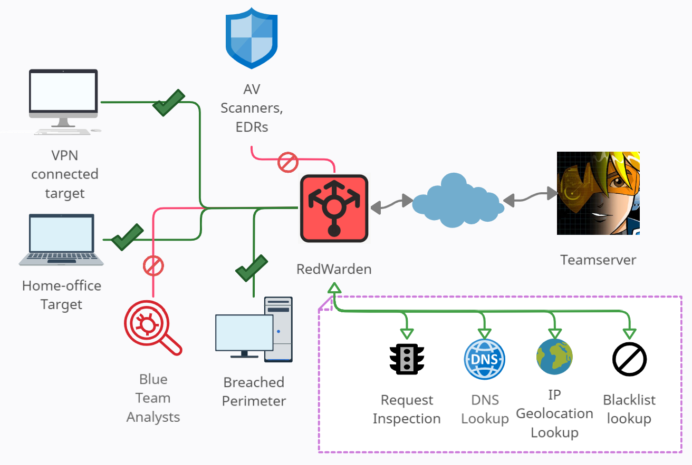
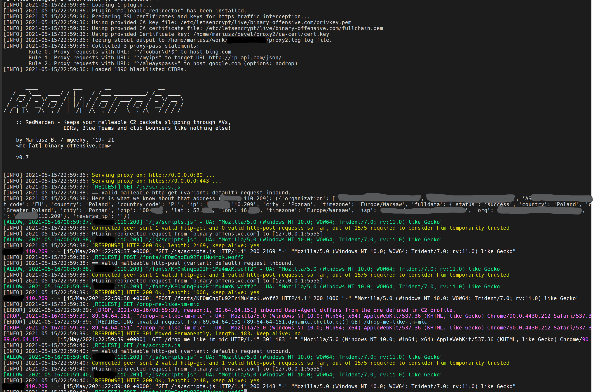
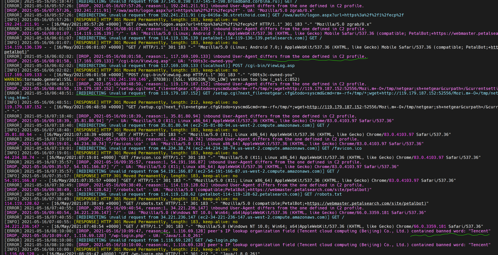
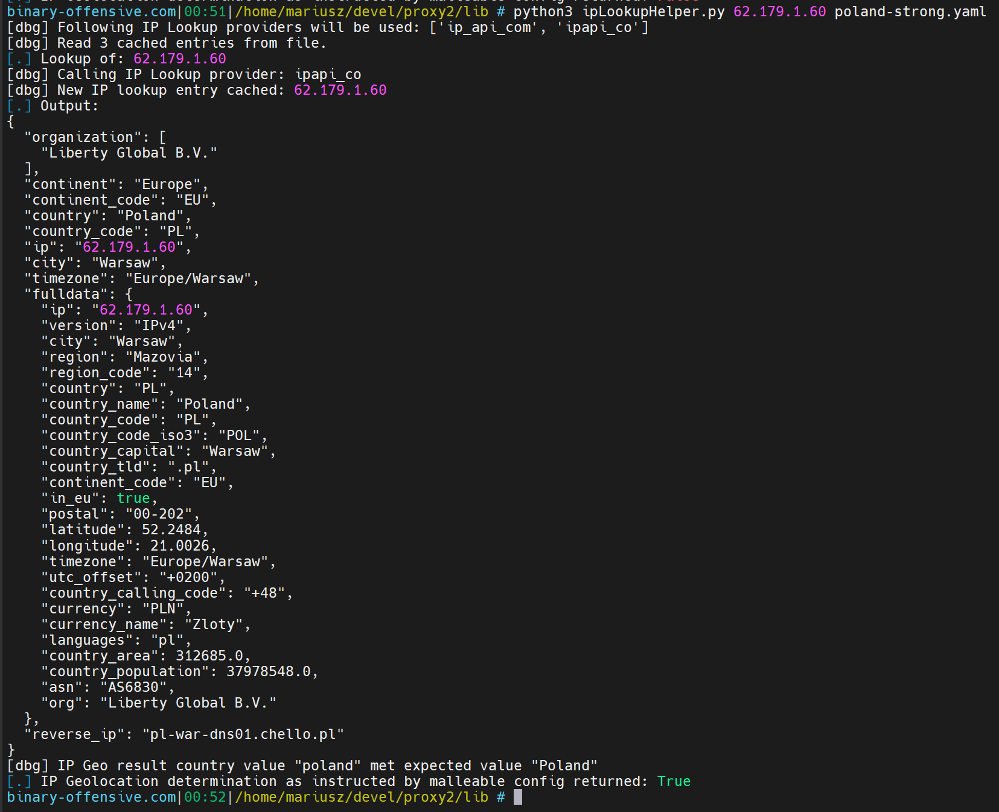

# RedWarden - Flexible CobaltStrike Malleable Redirector

(previously known as [proxy2's](https://github.com/mgeeky/proxy2) _malleable_redirector_ plugin)

**Let's raise the bar in C2 redirectors IR resiliency, shall we?**



Red Teaming business has seen [several](https://bluescreenofjeff.com/2016-04-12-combatting-incident-responders-with-apache-mod_rewrite/) [different](https://posts.specterops.io/automating-apache-mod-rewrite-and-cobalt-strike-malleable-c2-profiles-d45266ca642) [great](https://gist.github.com/curi0usJack/971385e8334e189d93a6cb4671238b10) ideas on how to combat incident responders and misdirect them while offering resistant C2 redirectors network at the same time.  

This work combines many of those great ideas into a one, lightweight utility, mimicking Apache2 in it's roots of being a simple HTTP(S) reverse-proxy. 

Combining Malleable C2 profiles understanding, knowledge of bad IP addresses pool and a flexibility of easily adding new inspection and misrouting logic - resulted in having a crafty repellent for IR inspections. 




Should any invalid inbound packet reach RedWarden - you can `redirect`, `reset` or just `proxy` it away!


## Abstract

This program acts as a HTTP/HTTPS reverse-proxy with several restrictions imposed upon inbound C2 HTTP requests selecting which packets to direct to the Teamserver and which to drop, similarly to the .htaccess file restrictions mandated in Apache2's `mod_rewrite`.

`RedWarden` was created to solve the problem of IR/AV/EDRs/Sandboxes evasion on the C2 redirector layer. It's intended to supersede classical Apache2 + mod_rewrite setups used for that purpose.

**Features:**

- Malleable C2 Profile parser able to validate inbound HTTP/S requests strictly according to malleable's contract and drop outlaying packets in case of violation (Malleable Profiles 4.0+ with variants covered)
- Ability to unfilter/repair unexpected and unwanted HTTP headers added by interim systems such as proxies and caches (think CloudFlare) in order to conform to a valid Malleable contract. 
- Integrated curated massive blacklist of IPv4 pools and ranges known to be associated with IT Security vendors
- Grepable output log entries (in both Apache2 combined access log and custom RedWarden formats) useful to track peer connectivity events/issues
- Ability to query connecting peer's IPv4 address against IP Geolocation/whois information and confront that with predefined regular expressions to rule out peers connecting outside of trusted organizations/countries/cities etc.
- Built-in Replay attacks mitigation enforced by logging accepted requests' MD5 hashsums into locally stored SQLite database and preventing requests previously accepted.
- Allows to define ProxyPass statemtents to pass requests matching specific URL onto other Hosts
- Support for multiple Teamservers
- Support for many reverse-proxying Hosts/redirection sites giving in a randomized order - which lets load-balance traffic or build more versatile infrastructures
- Can repair HTTP packets according to expected malleable contract in case some of the headers were corrupted in traffic
- Sleepless nights spent on troubleshooting "why my Beacon doesn't work over CloudFlare/CDN/Domain Fronting" are over now thanks to detailed verbose HTTP(S) requests/responses logs

The RedWarden takes Malleable C2 profile and teamserver's `hostname:port` on its input. It then parses supplied malleable profile sections to understand the contract and pass through only those inbound requests that satisfied it while misdirecting others. 

Sections such as `http-stager`, `http-get`, `http-post` and their corresponding uris, headers, prepend/append patterns, User-Agent are all used to distinguish between legitimate beacon's request and unrelated Internet noise or IR/AV/EDRs out of bound packets. 

The program benefits from the marvelous known bad IP ranges coming from:
  curi0usJack and the others:
  [https://gist.github.com/curi0usJack/971385e8334e189d93a6cb4671238b10](https://gist.github.com/curi0usJack/971385e8334e189d93a6cb4671238b10)

Using an IP addresses blacklisting along with known bad keywords lookup through Reverse-IP DNS queries and HTTP headers inspection, brings the reliability to considerably increase redirector's resiliency to the unauthorized peers wanting to examine attacker infrastructures.

Invalid packets may be misrouted according to three strategies:

- **redirect**: Simply redirect peer to another websites, such as Rick Roll.
- **reset**: Kill TCP connection straightaway.
- **proxy**: Fetch a response from another website, to mimic cloned/hijacked website as closely as possible.

This configuration is mandated in configuration file:

```yaml
#
# What to do with the request originating not conforming to Beacon, whitelisting or 
# ProxyPass inclusive statements: 
#   - 'redirect' it to another host with (HTTP 301), 
#   - 'reset' a TCP connection with connecting client
#   - 'proxy' the request, acting as a reverse-proxy against specified action_url 
#       (may be dangerous if client fetches something it shouldn't supposed to see!)
#
# Valid values: 'reset', 'redirect', 'proxy'. 
#
# Default: redirect
#
drop_action: redirect
```

Below example shows outcome of `redirect` to `https://googole.com`:




Use wisely, stay safe.

### Requirements

This program can run only on Linux systems as it uses fork to spawn multiple processes.

Also, the `openssl` system command is expected to be installed as it is used to generate SSL certificates.

Finally, install all of the Python3 PIP requirements easily with:

```shell
bash $ sudo pip3 install -r requirements.txt
```


## Usage

### Example usage

The minimal RedWarden's **config.yaml** configuration file could contain:

```yaml
port:
  - 80/http
  - 443/https

profile: jquery-c2.3.14.profile

ssl_cacert: /etc/letsencrypt/live/attacker.com/fullchain.pem
ssl_cakey: /etc/letsencrypt/live/attacker.com/privkey.pem

teamserver_url:
  - 1.2.3.4:8080

drop_action: reset
```

Then, the program can be launched by giving it a path to the config file:

```shell
bash$ sudo python3 RedWarden.py -c config.yaml

  [INFO] 19:21:42: Loading 1 plugin...
  [INFO] 19:21:42: Plugin "malleable_redirector" has been installed.
  [INFO] 19:21:42: Preparing SSL certificates and keys for https traffic interception...
  [INFO] 19:21:42: Using provided CA key file: ca-cert/ca.key
  [INFO] 19:21:42: Using provided CA certificate file: ca-cert/ca.crt
  [INFO] 19:21:42: Using provided Certificate key: ca-cert/cert.key
  [INFO] 19:21:42: Serving http proxy on: 0.0.0.0, port: 80...
  [INFO] 19:21:42: Serving https proxy on: 0.0.0.0, port: 443...
  [INFO] 19:21:42: [REQUEST] GET /jquery-3.3.1.min.js
  [INFO] 19:21:42: == Valid malleable http-get request inbound.
  [INFO] 19:21:42: Plugin redirected request from [code.jquery.com] to [1.2.3.4:8080]
  [INFO] 19:21:42: [RESPONSE] HTTP 200 OK, length: 5543
  [INFO] 19:21:45: [REQUEST] GET /jquery-3.3.1.min.js
  [INFO] 19:21:45: == Valid malleable http-get request inbound.
  [INFO] 19:21:45: Plugin redirected request from [code.jquery.com] to [1.2.3.4:8080]
  [INFO] 19:21:45: [RESPONSE] HTTP 200 OK, length: 5543
  [INFO] 19:21:46: [REQUEST] GET /
  [...]
  [ERROR] 19:24:46: [DROP, reason:1] inbound User-Agent differs from the one defined in C2 profile.
  [...]
  [INFO] 19:24:46: [RESPONSE] HTTP 301 Moved Permanently, length: 212
  [INFO] 19:24:48: [REQUEST] GET /jquery-3.3.1.min.js
  [INFO] 19:24:48: == Valid malleable http-get request inbound.
  [INFO] 19:24:48: Plugin redirected request from [code.jquery.com] to [1.2.3.4:8080]
  [...]
```

The above output contains a line pointing out that there has been an unauthorized, not compliant with our C2 profile inbound request, which got dropped due to incompatible User-Agent string presented:
```
  [...]
  [DROP, reason:1] inbound User-Agent differs from the one defined in C2 profile.
  [...]
```


## Use Cases

### Impose IP Geolocation on your Beacon traffic originators

You've done your Pre-Phish and OSINT very well. You now know where your targets live and have some clues where traffic should be originating from, or at least how to detect completely auxiliary traffic.
How to impose IP Geolocation on Beacon requests on a redirector?

RedWarden comes at help!

Let's say, you want only to accept traffic originating from Poland, Europe. 
Your Pre-Phish/OSINT results indicate that:

- `89.64.64.150` is a legitimate IP of one of your targets, originating from Poland
- `59.99.140.76` whereas this one is not and it reached your systems as a regular Internet noise packet.

You can use RedWarden's utility `lib/ipLookupHelper.py` to collect IP Geo metadata about these two addresses:

```shell
bash$ python3 ipLookupHelper.py

Usage: ./ipLookupHelper.py <ipaddress> [malleable-redirector-config]

Use this small utility to collect IP Lookup details on your target IPv4 address and verify whether
your 'ip_geolocation_requirements' section of proxy2 malleable-redirector-config.yaml would match that
IP address. If second param is not given - no 
```

The former brings:

```shell
bash$ python3 ipLookupHelper.py 89.64.64.150
[dbg] Following IP Lookup providers will be used: ['ip_api_com', 'ipapi_co']
[.] Lookup of: 89.64.64.150
[dbg] Calling IP Lookup provider: ipapi_co
[dbg] Calling IP Lookup provider: ip_api_com
[dbg] New IP lookup entry cached: 89.64.64.150
[.] Output:
{
  "organization": [
    "UPC Polska Sp. z o.o.",
    "UPC.pl",
    "AS6830 Liberty Global B.V."
  ],
  "continent": "Europe",
  "continent_code": "EU",
  "country": "Poland",
  "country_code": "PL",
  "ip": "89.64.64.150",
  "city": "Warsaw",
  "timezone": "Europe/Warsaw",
  "fulldata": {
    "status": "success",
    "country": "Poland",
    "countryCode": "PL",
    "region": "14",
    "regionName": "Mazovia",
    "city": "Warsaw",
    "zip": "00-202",
    "lat": 52.2484,
    "lon": 21.0026,
    "timezone": "Europe/Warsaw",
    "isp": "UPC.pl",
    "org": "UPC Polska Sp. z o.o.",
    "as": "AS6830 Liberty Global B.V.",
    "query": "89.64.64.150"
  },
  "reverse_ip": "89-64-64-150.dynamic.chello.pl"
}
```

and the latter gives:

```shell
bash$ python3 ipLookupHelper.py 59.99.140.76
[dbg] Following IP Lookup providers will be used: ['ip_api_com', 'ipapi_co']
[dbg] Read 1 cached entries from file.
[.] Lookup of: 59.99.140.76
[dbg] Calling IP Lookup provider: ip_api_com
[dbg] New IP lookup entry cached: 59.99.140.76
[.] Output:
{
  "organization": [
    "",
    "BSNL Internet",
    "AS9829 National Internet Backbone"
  ],
  "continent": "Asia",
  "continent_code": "AS",
  "country": "India",
  "country_code": "IN",
  "ip": "59.99.140.76",
  "city": "Palakkad",
  "timezone": "Asia/Kolkata",
  "fulldata": {
    "status": "success",
    "country": "India",
    "countryCode": "IN",
    "region": "KL",
    "regionName": "Kerala",
    "city": "Palakkad",
    "zip": "678001",
    "lat": 10.7739,
    "lon": 76.6487,
    "timezone": "Asia/Kolkata",
    "isp": "BSNL Internet",
    "org": "",
    "as": "AS9829 National Internet Backbone",
    "query": "59.99.140.76"
  },
  "reverse_ip": ""
}
```

Now you see that the former one had `"country": "Poland"` whereas the latter `"country": "India"`. With that knowledge we are ready to devise our constraints in form of a hefty YAML dictionary:

```yaml
ip_geolocation_requirements:
  organization:
  continent:
  continent_code:
  country:
     - Poland
     - PL
     - Polska
  country_code:
  city:
  timezone:
```

Each of that dictionary's entries accept regular expression to be matched upon determined IP Geo metadata of inbound peer's IP address.
We use three entries in `country` property to allow requests having one of specified values.

Having that set in your configuration, you can verify whether another IP address would get passed through RedWarden's IP Geolocation discriminator or not with `ipLookupHelper` utility accepting second parameter:



The very last line tells you whether packet would be blocked or accepted.

And that's all! Configure your IP Geolocation constraints wisely and safely, carefully inspect RedWarden logs for any IP Geo-related DROP entries and keep your C2 traffic nice and tidy!


### Repair tampered Beacon requests

If you happen to use interim systems such as AWS Lambda or CloudFlare as your Domain Fronting / redirectors, you have surely came across a situation where some of your packets couldn't get accepted by the Teamserver as they deviated from the agreed malleable contract. Was it a tampered or removed HTTP header, reordered cookies or anything else - I bet that wasted plenty hours of your life.

To combat C2 channels setup process issues and interim systems tamperings, RedWarden offers functionality to repair Beacon packets.

It does so by checking what Malleable Profile expects packet to be and can restore configured HTTP headers to their agreed values according to the profile's requirements.

Consider following simple profile:

```
http-get {
    set uri "/api/abc";
    client {

        header "Accept-Encoding" "gzip, deflate";

        metadata {
            base64url;
            netbios;
            base64url;
            parameter "auth";
        }
    }
    ...
```

You see this `Accept-Encoding`? Every Beacon request has to come up with that Header and that value. What happens if your Beacon hits CloudFlare systems and they emit a request that will be stripped from that Header or will have `Accept-Encoding: gzip` instead? Teamserver will drop the request on the spot.

By setting this header in RedWarden configuration section dubbed `protect_these_headers_from_tampering` you can safe your connection.:

```yaml
#
# If RedWarden validates inbound request's HTTP headers, according to policy drop_malleable_without_expected_header_value:
#   "[IP: DROP, reason:6] HTTP request did not contain expected header value:"
#
# and senses some header is missing or was overwritten along the wire, the request will be dropped. We can relax this policy
# a bit however, since there are situations in which Cache systems (such as Cloudflare) could tamper with our requests thus
# breaking Malleable contracts. What we can do is to specify list of headers, that should be overwritten back to their values
# defined in provided Malleable profile.
#
# So for example, if our profile expects:
#   header "Accept-Encoding" "gzip, deflate";
#
# but we receive a request having following header set instead:
#   Accept-Encoding: gzip
#
# Because it was tampered along the wire by some of the interim systems (such as web-proxies or caches), we can
# detect that and set that header's value back to what was expected in Malleable profile.
#
# In order to protect Accept-Encoding header, as an example, the following configuration could be used:
#   protect_these_headers_from_tampering:
#     - Accept-Encoding
#
#
# Default: <empty-list>
#
protect_these_headers_from_tampering:
  - Accept-Encoding
```


### Example outputs

Let's take a look at the output the proxy produces.

Under `verbose: True` option, the verbosity will be set to INFO at most telling accepted requests from dropped ones.

The request may be accepted if it confronted to all of the criterias configured in RedWarden's configuration file. Such a situation will be followed with `[ALLOW, ...]` entry log:

```
[INFO] 2021-04-24/17:30:48: [REQUEST] GET /js/scripts.js
[INFO] 2021-04-24/17:30:48: == Valid malleable http-get (variant: default) request inbound.
[INFO] 2021-04-24/17:30:48: [ALLOW, 2021-04-24/19:30:48, 111.222.223.224] "/js/scripts.js" - UA: "Mozilla/5.0 (Windows NT 10.0; WOW64; Trident/7.0; rv:11.0) like Gecko"
[INFO] 2021-04-24/17:30:48: Connected peer sent 2 valid http-get and 0 valid http-post requests so far, out of 15/5 required to consider him temporarily trusted
[INFO] 2021-04-24/17:30:48: Plugin redirected request from [attacker.com] to [127.0.0.1:5555]
```

Should the request fail any of the checks RedWarden carries on each request, the corresponding `[DROP, ...]` line will be emitted containing information about the drop **reason**.:

```
[INFO] 2021-04-24/16:48:28: [REQUEST] GET /
[ERROR] 2021-04-24/16:48:29: [DROP, 2021-04-24/18:48:28, reason:1, 128.14.211.186] inbound User-Agent differs from the one defined in C2 profile.
[INFO] 2021-04-24/16:48:29: [DROP, 2021-04-24/18:48:28, 128.14.211.186] "/" - UA: "Mozilla/5.0 (Windows NT 10.0; Win64; x64) AppleWebKit/537.36 (KHTML, like Gecko) Chrome/60.0.3112.113 Safari/537.36"
[ERROR] 2021-04-24/16:48:29: [REDIRECTING invalid request from 128.14.211.186 (zl-dal-us-gp3-wk107.internet-census.org)] GET /
```


### Drop Policies Fine-Tuning

There are plenty of reasons dictating whether request can be dropped. Each of these checks can be independently turned on and off according to requirements or in a process of fine-tuning or erroneus decision fixing:

Excerpt from `example-config.yaml`:

```yaml
#
# Fine-grained requests dropping policy - lets you decide which checks
# you want to have enforced and which to skip by setting them to False
#
# Default: all checks enabled
#
policy:
  # [IP: ALLOW, reason:0] Request conforms ProxyPass entry (url="..." host="..."). Passing request to specified host
  allow_proxy_pass: True
  # [IP: ALLOW, reason:2] Peer's IP was added dynamically to a whitelist based on a number of allowed requests
  allow_dynamic_peer_whitelisting: True
  # [IP: DROP, reason:1] inbound User-Agent differs from the one defined in C2 profile.
  drop_invalid_useragent: True
  # [IP: DROP, reason:2] HTTP header name contained banned word
  drop_http_banned_header_names: True
  # [IP: DROP, reason:3] HTTP header value contained banned word:
  drop_http_banned_header_value: True
  # [IP: DROP, reason:4b] peer's reverse-IP lookup contained banned word
  drop_dangerous_ip_reverse_lookup: True
  # [IP: DROP, reason:4e] Peer's IP geolocation metadata contained banned keyword! Peer banned in generic fashion.
  drop_ipgeo_metadata_containing_banned_keywords: True
  # [IP: DROP, reason:5] HTTP request did not contain expected header
  drop_malleable_without_expected_header: True
  # [IP: DROP, reason:6] HTTP request did not contain expected header value:
  drop_malleable_without_expected_header_value: True
  # [IP: DROP, reason:7] HTTP request did not contain expected (metadata|id|output) section header:
  drop_malleable_without_expected_request_section: True
  # [IP: DROP, reason:8] HTTP request was expected to contain (metadata|id|output) section with parameter in URI:
  drop_malleable_without_request_section_in_uri: True
  # [IP: DROP, reason:9] Did not found append pattern:
  drop_malleable_without_prepend_pattern: True
  # [IP: DROP, reason:10] Did not found append pattern:
  drop_malleable_without_apppend_pattern: True
  # [IP: DROP, reason:11] Requested URI does not aligns any of Malleable defined variants:
  drop_malleable_unknown_uris: True
  # [IP: DROP, reason:12] HTTP request was expected to contain <> section with URI-append containing prepend/append fragments
  drop_malleable_with_invalid_uri_append: True
```


By default all of these checks are enforced.

Turning `debug: True` will swamp your console buffer with plenty of log lines describing each step RedWarden takes in its complex decisioning process. 
If you want to see your requests and responses full bodies - set `debug` and `trace` to true and get buried in logging burden!


## Known Issues

- It _may_ add a slight overhead to the interactive sleep throughput
- ProxyPass processing logic is far from perfect and is _really_ buggy (and oh boy its ugly!).
- Weird forms of configuration files can derail RedWarden parser and make it complain. Easiest approach to overcome this would be to copy `example-config.yaml` and work on it instead.


## Oh my god why is this code such an engineerical piece of crap?

The code is _ONE FUCKING BIG HELL OF A MESS_ - I admit that - and there's an honest reason for that too: the project was being developed 90% during the actual Red Team engagements. As we all know, these sorts of engagements entail so many things to do, leaving close to no time for a proper complex tool development. Not to mention criticality of this program in project's setup. The tool initialy started as a simple proxy script written in Python2, to then evolve as a proxy with plugins, received `malleable_redirector` plugin - and since all that time I've been trying hard to keep `proxy2` maintain backwards compatibility (poor me, I was like Microsoft!). Time has come though to let it go, rebrand it and start fixing all the crap introduced.

With all that said, please do express some level of compassion for me when raising issues, submitting pull requests and try to help rather than judge! :-)
Thanks!


## TODO

- Research possibility to use Threat Intelligence feeds to nefarious purposes - like for instance detecting Security Vendors based on IPs
- Add support for MaxMind GeoIP database/API
- Implement support for JA3 signatures in both detection & blocking and impersonation to fake nginx/Apache2/custom setups.
- Add some unique beacons tracking logic to offer flexilibity of refusing staging and communication processes at the proxy's own discretion
- Introduce day of time constraint when offering redirection capabilities (_proxy only during office hours_)
- Add Proxy authentication and authorization logic on CONNECT/relay.
- Add Mobile users targeted redirection
- Add configuration options to define custom HTTP headers to be injected, or ones to be removed
- Add configuration options to require specific HTTP headers to be present in requests passing ProxyPass criteria.
- Interactive interface allowing to type simple characters controlling output logging verbosity, similarly to Nmap's
- Refactor all the codebase

## Author

```
Mariusz B. / mgeeky, '19-'21
<mb@binary-offensive.com>
```
